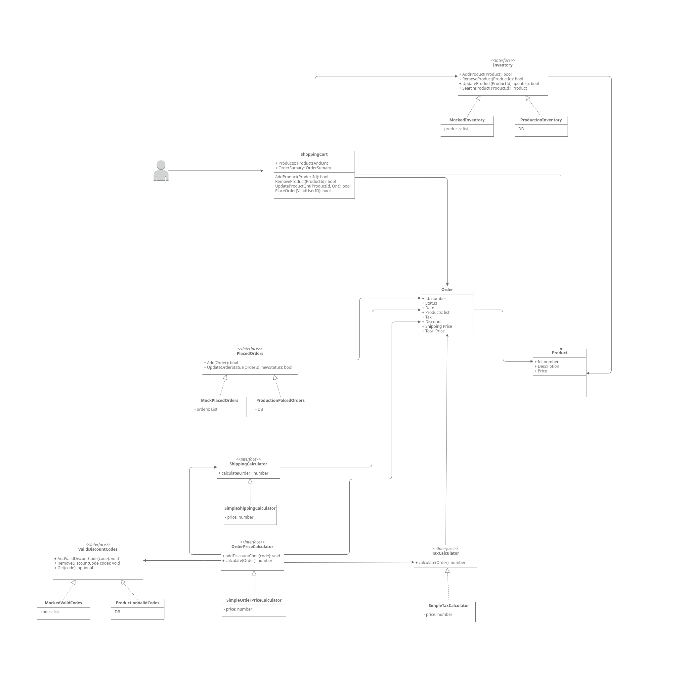

# E-Commerce 

  

- [ ] Orders multiple products
- [ ] Modify product quantity
- [ ] Calculte shipping cost
- [ ] Calculate tax
- [ ] Apply discount code
- [ ] Stock Management
- [ ] Cancel Order

  

## Tests

  - Invalid ID [CPF validator algorithm](https://www.macoratti.net/alg_cpf.htm) ( CPF - brazilian ID )
  - Orders with 3 or more items (description, price e ammount)
  - Create an order with discount code

  

## Design

